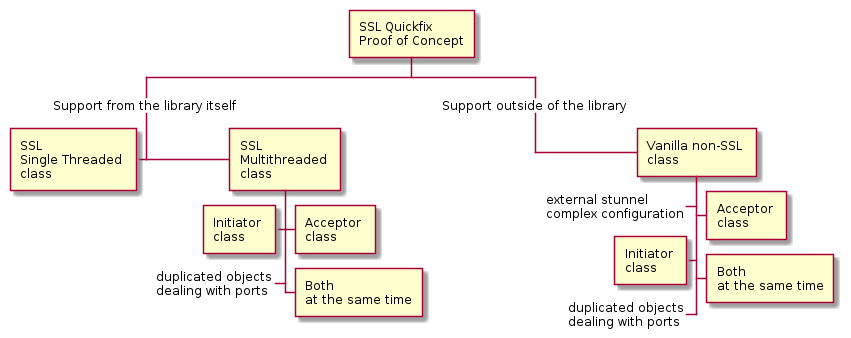

# sslQuickfix

Proof of concept about SSL configuration for [quickfix](http://www.quickfixengine.org/) based projects. That library was cretated by [Oren Miller](oren@quickfixengine.org) and its [documentation](http://www.quickfixengine.org/quickfix/doc/html/) can be found at their side.

There are several options to check out:

Due to some vanilla configuration files, i.e. acceptor ports, a simple XML configuration was implemented. Try to prevent your code from using modern C++ features; typical quickfix business based binaries are meant for classic Linux servers.

## Install quickfix library

Double check that your version is up-to-date enough to support SSL internally and [install it on your system](quickfix/README.md).

## Simplest check quickfix library

A [simplest project](simplest/README.md), inspired from [Mike Gatny's quickfix 101](https://github.com/mgatny/quickfix_101), should test that our previous quickfix installation. Basically extended vanilla examples on their very original SSL certificates.

## Check certificates

Reusing previous code, this subtask aims at [checking our own certificates](checkcert/README.md) and at running a simple connection with them. Take into account this subsection is very dependent upon your concrete operating system.

Some strange issue detected about settings objects; it looks like only 'default' certification configurations make it to SSL utility classes. 
